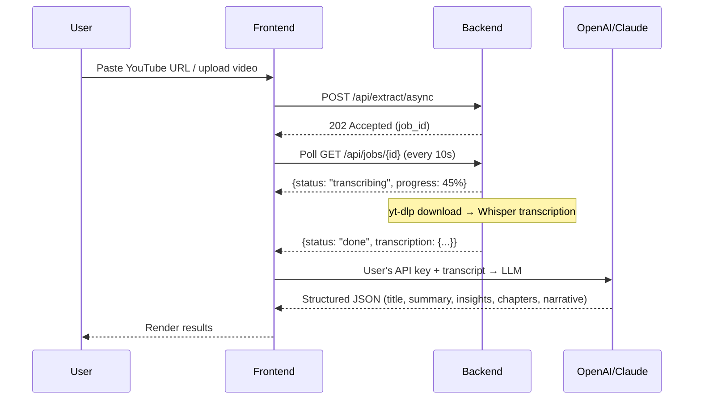

# Looma

Convert a YouTube link or an uploaded video into structured, reusable
knowledge — refined title, summary, key insights, chapter markers, and
an audio-friendly narration.

> **Deployed on Hugging Face Spaces** — try it at
> [Ethan0103/Looma](https://huggingface.co/spaces/Ethan0103/Looma).

## How it works

Looma runs the CPU-heavy work (download + Whisper transcription) on the
server and lets the **frontend** handle AI extraction with your own API
key — no server-side LLM costs, no key sharing.



## Features
- **Two ingest paths:** paste a YouTube URL, or upload `.mp4 / .mov / .mkv /
  .webm` (≤200 MB).
- **Whisper transcription** with configurable model size (`tiny|base|small|
  medium|large`, default `small`).
- **BYOK AI extraction** — bring your own API key (OpenAI or Claude). Your key
  stays in your browser and is never sent to the server.
- **JSON repair pipeline** — think-block stripping, markdown fence removal,
  trailing-comma fix, brace-trim fallback, all running in the browser.
- **Settings panel** — configure provider, API key, custom domain, and model
  from the UI. Config is persisted in `localStorage`.
- **Test connection** button to verify your API key before running a job.
- **Single-page UI** with tabbed input, live stage progress, and a
  "Copy as Markdown" button.
- **Canonical error responses** — every non-2xx body uses
  `{"error": "<msg>", "code": "<machine_code>"}`.

## Prerequisites
- **Python 3.11+** (tested with 3.11 and 3.12).
- **`ffmpeg`** on `$PATH` (install with `sudo apt-get install -y ffmpeg`
  on Debian/Ubuntu). `ffprobe` is also expected; the install
  command above provides both.
- An **OpenAI** or **Anthropic** API key for the AI extraction step
  (configured in the browser Settings panel — not on the server).
- A modern browser to use the UI at `http://127.0.0.1:8000/`.

## Quick Start
```bash
# 1. Clone and enter the project
cd looma

# 2. Copy the env template (server only needs ffmpeg — no API keys)
cp .env.example .env

# 3. Create a virtualenv and install dependencies
cd backend
python -m venv .venv
source .venv/bin/activate
pip install -r requirements.txt

# 4. Verify your environment
python -c "import whisper, yt_dlp, fastapi; print('ok')"
ffmpeg -version | head -1

# 5. Run the app (from the repo root)
cd ..
bash run.sh
```

Then open <http://127.0.0.1:8000/> in a browser and click the ⚙️ icon
to configure your LLM API key.

## Environment Variables
See `.env.example` for the full list. The server only needs `ffmpeg` —
**no API keys are required** on the server side.

| Variable | Required | Default | Purpose |
| --- | --- | --- | --- |
| `WHISPER_MODEL` | no | `small` | `tiny\|base\|small\|medium\|large`. |
| `MAX_VIDEO_SECONDS` | no | `5400` | Reject videos longer than 90 min. |
| `MAX_UPLOAD_MB` | no | `200` | Reject uploads larger than 200 MB. |
| `MAX_AUDIO_BYTES` | no | `52428800` | Reject audio files >50 MB. |
| `DATA_DIR` | no | `./data` | Where MP3s live. |
| `HOST` | no | `127.0.0.1` | Bind address. |
| `PORT` | no | `8000` | Bind port. |

## Frontend Configuration
When you open the app in your browser, click the ⚙️ icon in the header
to open the Settings panel:

| Setting | Description |
| --- | --- |
| **LLM Provider** | `OpenAI` or `Claude (Anthropic)` |
| **API Key** | Your personal API key (stored in browser only) |
| **Custom Domain** | Optional — override the API endpoint (e.g., for a proxy) |
| **Model** | Optional — override the default model (`gpt-4o-mini` / `claude-3-5-sonnet`) |

## Run
After installing, two equivalent ways to launch the dev server:

```bash
# Option A: helper script (loads .env, activates venv)
bash run.sh                # http://127.0.0.1:8000
bash run.sh --reload       # with uvicorn --reload

# Option B: invoke uvicorn directly
cd backend && source .venv/bin/activate
uvicorn app.main:app --host 127.0.0.1 --port 8000
```

Once running, the following are live:

| URL | What it serves |
| --- | --- |
| `http://127.0.0.1:8000/` | Single-page UI. |
| `http://127.0.0.1:8000/healthz` | Liveness probe (always 200). |
| `http://127.0.0.1:8000/api/jobs?limit=20` | Most recent 20 jobs. |
| `http://127.0.0.1:8000/docs` | Auto-generated OpenAPI / Swagger UI. |

## Project Layout
```
looma/
├── backend/
│   ├── app/
│   │   ├── main.py         # FastAPI routes + job manager
│   │   ├── config.py        # Env-driven settings
│   │   ├── models.py        # Pydantic schemas
│   │   ├── pipeline/
│   │   │   ├── ingest.py    # YouTube download / upload conversion
│   │   │   ├── transcribe.py  # Whisper transcription
│   │   │   └── orchestrator.py  # Pipeline runner
│   │   └── jobs.py          # In-memory async job manager
│   ├── tests/               # pytest suite
│   ├── requirements.txt
│   └── .env.example
├── frontend/                # {index.html, styles.css, app.js}
│   └── app.js              # LLM calls, JSON repair, settings (BYOK)
├── Dockerfile               # HF Spaces / Docker deployment
├── data/                    # runtime: audio/
└── docs/
```

## License
MIT
